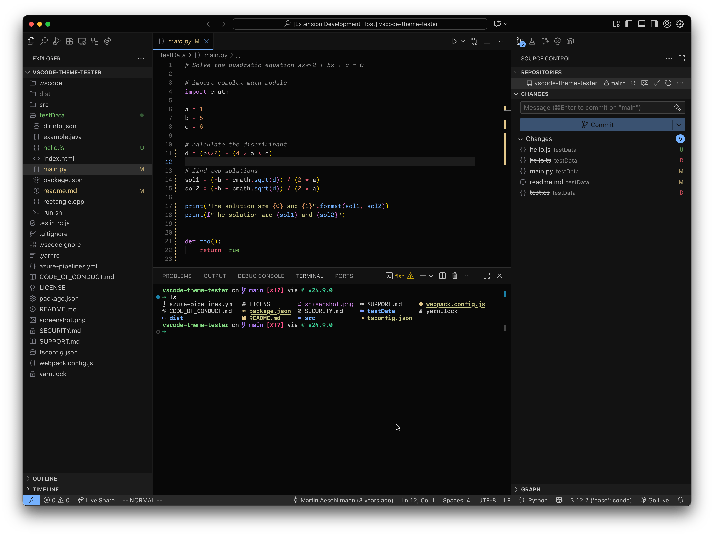

# Moonfly Theme for Visual Studio Code

An effort to port the [moonfly](https://github.com/bluz71/vim-moonfly-colors) theme created by [bluz71](https://github.com/bluz71) for Neovim and Vim.

Moonfly is a dark charcoal theme with carefully chosen, vibrant syntax highlighting that's easy on the eyes during long coding sessions.

This project was mostly made with generative AI, so please don't take this port seriously. I don't want to diminish the original theme's efforts. Any additions or comments are very welcome!

## Screenshot

## Color Palette

The theme uses a dark charcoal background (`#080808`) with these core colors:

- **Red**: `#ff5d5d` - Errors, deletions, invalid
- **Green**: `#8cc85f` - Additions, built-ins, language methods
- **Yellow**: `#e3c78a` - Warnings, modifications
- **Blue**: `#80a0ff` - HTML/XML tags, CSS classes
- **Purple**: `#ae81ff` - Template strings, special strings, markup link URLs
- **Cyan**: `#79dac8` - Attributes, identifiers, modules, regex
- **Orange**: `#de935f` - Numbers, constants, function arguments
- **Violet**: `#cf87e8` - Keywords, storage, control flow
- **Emerald**: `#36c692` - Types, classes, constructors
- **Sky**: `#74b2ff` - Functions, methods, imports
- **Khaki**: `#c6c684` - Strings, symbols, headings
- **Cranberry**: `#e65e72` - Operators, escape characters, punctuation
- **Lavender**: `#adadf3` - CSS properties
- **Orchid**: `#e196a2` - Parameters, markup bold/italic

## Installation

### From VS Code Marketplace

1. Open VS Code
2. Go to Extensions (`Ctrl+Shift+X` or `Cmd+Shift+X`)
3. Search for "Moonfly Theme"
4. Click Install
5. Go to `File > Preferences > Color Theme` and select "Moonfly"

### Manual Installation

1. Clone this repository
2. Copy the folder to your VS Code extensions directory:
   - **Windows**: `%USERPROFILE%\.vscode\extensions`
   - **macOS**: `~/.vscode/extensions`
   - **Linux**: `~/.vscode/extensions`
3. Restart VS Code
4. Go to `File > Preferences > Color Theme` and select "Moonfly"

## Credits

- **Original Theme**: [bluz71/vim-moonfly-colors](https://github.com/bluz71/vim-moonfly-colors)
- **Creator**: [bluz71](https://github.com/bluz71)

This VS Code port maintains the exact color palette and syntax highlighting philosophy of the original Neovim/Vim theme.

## License

MIT License - See [LICENSE](LICENSE) file for details.

The original moonfly theme is also under MIT license.
